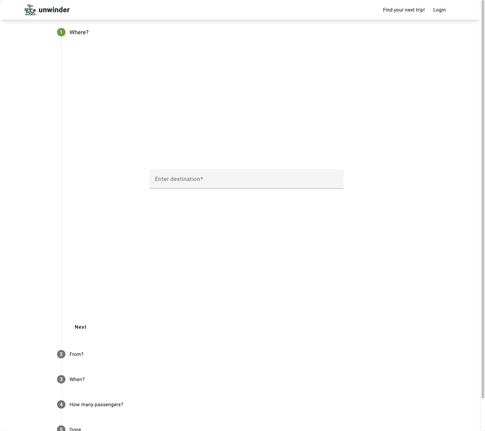

# Unwinder (Work in Progress)

Unwinder is an application designed to help you plan quick, stress-free weekend getaways. Perfect for those looking to unwind during busy periods, it simplifies the process of finding flights and accommodations for your short trips.

## Tech Stack

- **API**: Amadeus API for real-time flight information.
- **Backend**: Developed with .NET Core Web API, tested with NUnit.
- **Frontend**: Built using: Angular, Angular Material, Tailwind, Sass with Jest for testing.
- **Tooling**: Version control with Git-Flow, containerization with Docker, and continuous integration/deployment via Azure CI/CD.

## Features

### Main page

### Flight Search

## Development Roadmap

This roadmap outlines the key features planned for Unwinder that will be realised during ongoing development:

1. **Hotel Booking Feature**: Integrate hotel search and booking functionality.
2. **User Accounts**: Implement account creation and management.
3. **Trip Wishlist**: Allow users to save and manage a list of preferred flights and hotels.
4. **Booking System**: Enable users to book flights and hotels through the app.
5. **Error Handling Middleware**: Improve app stability and user experience by handling errors gracefully.
6. **Azure Deployment**: Deploy the application on Azure.
