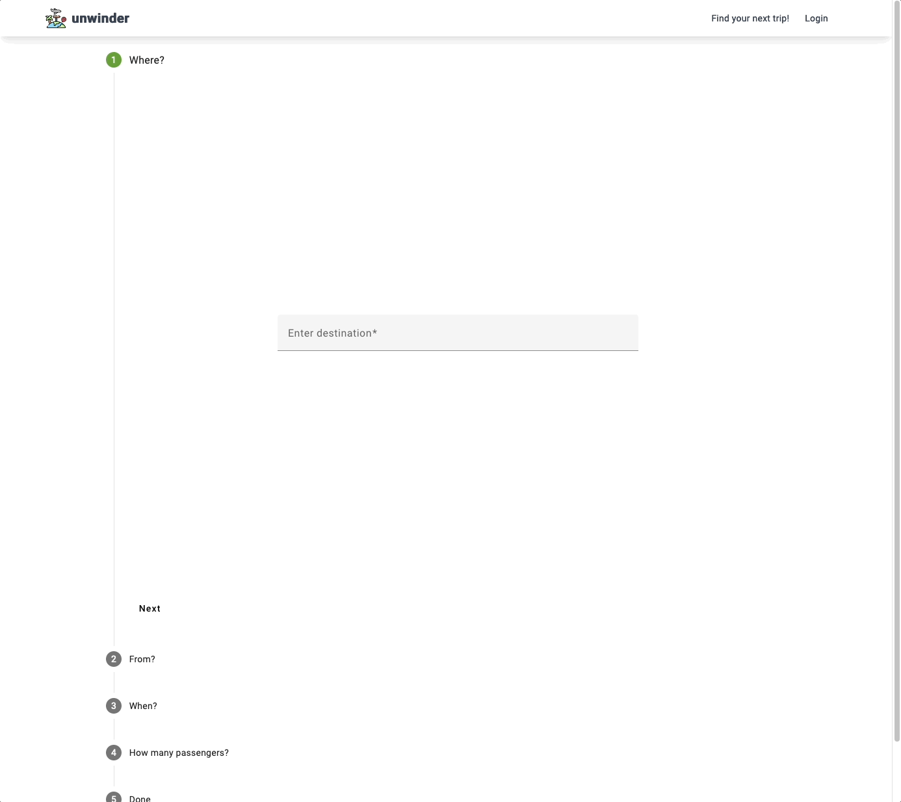

# Unwinder

Unwinder is a weekend trip planner built as a personal full-stack project. It brings destination search, flight offers, and accommodation discovery into one guided flow for short getaways. The Angular frontend connects to an ASP.NET Core API, which integrates with the Amadeus test environment.

## Explore the app

- Plan a short or long weekend by choosing a destination, departure city, dates, and passengers.
- Look up cities and airports through the Amadeus API.
- Browse outbound and return flight offers in a two-step results flow.
- Continue from a selected flight into hotel discovery for the destination and travel dates.

The backend includes services for Amadeus authentication, location lookup, flight search, and hotel offers. It reuses OAuth tokens across requests and maps API responses into models used by the frontend. NUnit tests cover backend services and helpers; Jest tests cover frontend components and services. An Azure Pipelines definition builds the projects and runs the test suites.

## Preview

### Main page


### Flight search



## Tech stack

| Area | Technologies |
| --- | --- |
| Backend | ASP.NET Core, .NET 7, NUnit, Moq, AutoFixture |
| Frontend | Angular 17, TypeScript, Angular Material, Tailwind CSS, Sass, Jest |
| Travel data | Amadeus test API |
| CI | Azure Pipelines |

## Run locally

You'll need the [.NET 7 SDK](https://dotnet.microsoft.com/en-us/download/dotnet/7.0), Node.js 20 with npm, and [Amadeus test API credentials](https://developers.amadeus.com/).

From the repository root, install dependencies:

```bash
dotnet restore unwinder.sln
npm ci --prefix unwinder/ClientApp
```

Store your Amadeus credentials with .NET user secrets:

```bash
dotnet user-secrets set "AmadeusFlight:ServiceApiKey" "YOUR_API_KEY" --project unwinder/unwinder.csproj
dotnet user-secrets set "AmadeusFlight:ServiceSecretApiKey" "YOUR_API_SECRET" --project unwinder/unwinder.csproj
```

Start the application:

```bash
dotnet run --project unwinder/unwinder.csproj
```

The development profile starts the Angular app through the SPA proxy. Open the URL printed by `dotnet run`; the default HTTPS backend address is `https://localhost:7118`.

## Tests

```bash
dotnet test unwinder.tests/unwinder.tests.csproj
npm test --prefix unwinder/ClientApp -- --runInBand
```

Unwinder focuses on the search and discovery part of planning a weekend away. The repository includes the application code, automated tests, and the CI definition so the flow can be explored locally.
